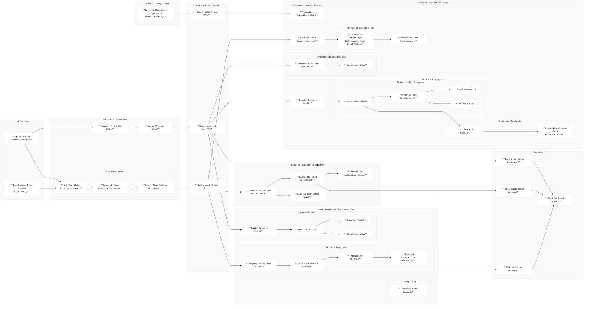

```mermaid
graph LR
    %%{init: {'theme': 'base', 'themeVariables': { 'primaryColor': '#ffffff', 'primaryTextColor': '#000000', 'primaryBorderColor': '#000000', 'lineColor': '#000000', 'secondaryColor': '#f4f4f4', 'tertiaryColor': '#f9f9f9', 'fontFamily': 'Roboto Mono, monospace', 'fontSize': '16px', 'nodeBorder': '1px', 'mainBkg': '#ffffff' }}}%%    subgraph Initialize
        AA[**Speckle User Authentication**]
        AB[**Initialize Team Metric<br>Dictionary**]
    end

    AA --> BC
    AA ---> BA

    AB --> BC

    subgraph Speckle Integration
        BA[**Request Projects Data**]
        BA --> BB[**Cache Project Data**]
        
        subgraph For Each Team
            BC[**Get Attributes<br>From Data Model**]
            BC --> BE[**Request Team Metric Attributes**]
            BE --> BF[**Cache Team Metric Attributes**]
        end
    end

    subgraph Github Integration
        EA[**Request Dashboard Repository<br>Commit History**]
    end

    BB --> CA
    BF --> CB
    EA --> CC

    subgraph Data Caching System
        CA[**Cache with 12 hour TTL**]
        CB[**Cache with 5 min TTL**]
        CC[**Cache with 6 hour TTL**]
    end


    subgraph Project Statistics Page
        subgraph Network Graph Tab
            DD[**Create Network Graph**]
            DD --> DE[**User Selection**]
            DE ---> DF
            subgraph Combined Analysis
                DF[**Display All Models**]
                DF ---> DH[**Visualize Version Data<br>For Each Model**]
            end
            subgraph Single Model Analysis
                DE --> DI[**User Select Single Model**]
                DI --> DJ[**Display Model**]
                DI --> DK[**Visualize Data**]
            end
        end
        subgraph Overall Statistics Tab
            DL[**Combine Data for Project**]
            DL --> DM[**Visualize Data**]
        end
        subgraph Metric Statistics Tab
            DA[**Process Each Team's Metrics**]
            DA --> DB[**Calculate Percentage Difference from Ideal Values**]
            DB --> DC[**Visualize Team Performance**]
        end
        subgraph Dashboard Statistics Tab
            DN[**Visualize Repository Data**]
        end
    end


    subgraph Team Dashboard for Each Team
        subgraph Concept Tab
            FD[**Display Team Concept**]
        end
        subgraph Metrics Analysis
            FE[**Display Extracted Values**]
            FE --> FH[**Calculate Metric Values**]
            FH --> FF[**Visualize Metrics**]
            FF --> FG[**Display Interactive Calculators**]
        end
        subgraph Network Tab
            FA[**Build Network Graph**]
            FA --> FB[**User Selection**]
            FB --> FC[**Display Model**]
            FB --> FI[**Visualize Data**]
        end
    end
    CB --> GA
    subgraph Data Validation Dashboard
        GA[**Combine Extracted Metric Data**]
        GA --> GC[**Calculate Data Validation**]
        GC --> GD[**Visualize Validation Score**]
        GA --> GE[**Display Extracted Data**]
    end

    subgraph SlackBot
        HA[**Recent Versions Meassage**]
        GC -----> HB[**Data Validation Message**]
        FH -----> HC[**Metric Value Message**]
        HA --> HD[**Send To Slack Channel**]
        HB --> HD
        HC --> HD
    end
    CA --> FA
    CA ---> DD
    CA -----> HA
    CA --> DL
    CB --> FE
    CB --> DA
    CC --> DN
```