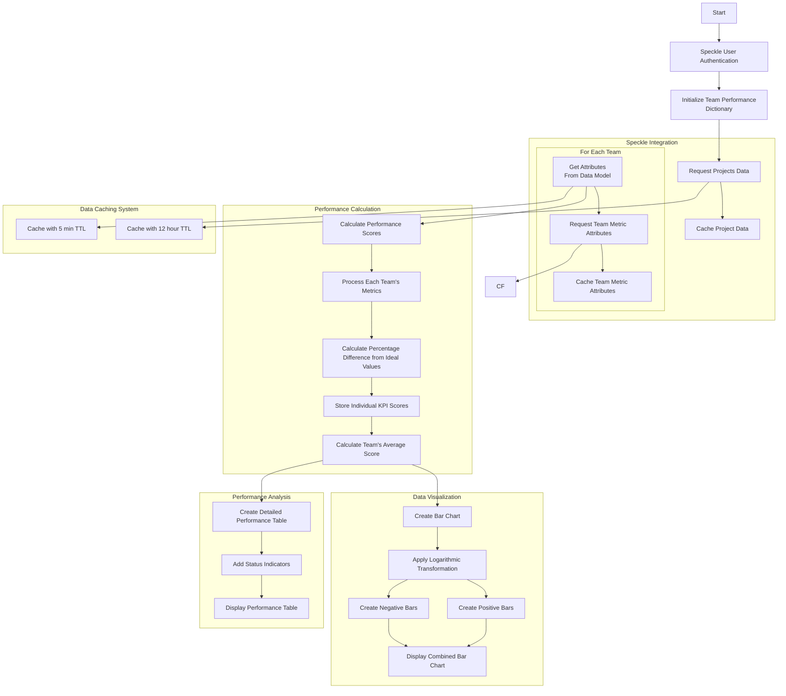

```mermaid
graph TD
    A[Start] --> AA[Speckle User Authentication]
    AA --> B[Initialize Team Performance<br>Dictionary]
    
    subgraph Speckle Integration
        BA[Request Projects Data]
        BA --> BB[Cache Project Data]
        
        subgraph For Each Team
            BC[Get Attributes<br>From Data Model]
            BC --> BE[Request Team Metric Attributes]
            BE --> BF[Cache Team Metric Attributes]
        end
   end
    
    B --> BA
    BC --> C[Calculate Performance Scores]
    BE --> CF

    subgraph Performance Calculation
        C --> D[Process Each Team's Metrics]
        D --> E[Calculate Percentage Difference from Ideal Values]
        E --> F[Store Individual KPI Scores]
        F --> G[Calculate Team's Average Score]
    end
    
    subgraph Data Visualization
        G --> H[Create Bar Chart]
        H --> I[Apply Logarithmic Transformation]
        I --> J1[Create Positive Bars]
        I --> J2[Create Negative Bars]
        J1 --> K[Display Combined Bar Chart]
        J2 --> K
    end
    
    subgraph Performance Analysis
        G --> L[Create Detailed Performance Table]
        L --> M[Add Status Indicators]
        M --> N[Display Performance Table]
    end
    
    subgraph Data Caching System
        CA[Cache with 12 hour TTL]
        CB[Cache with 5 min TTL]
    end
    
    BA --> CA
    BC --> CB
```